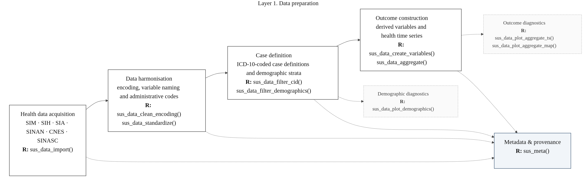
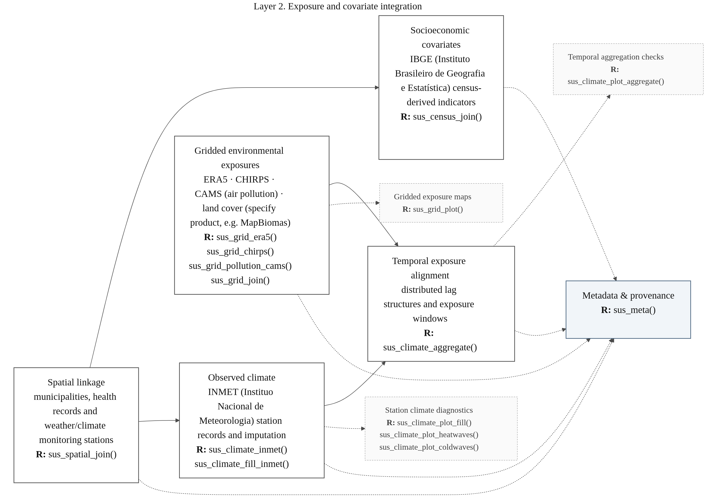
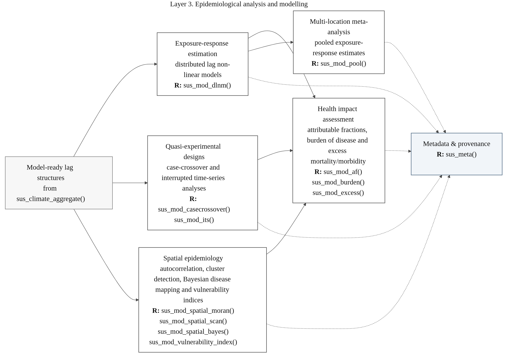
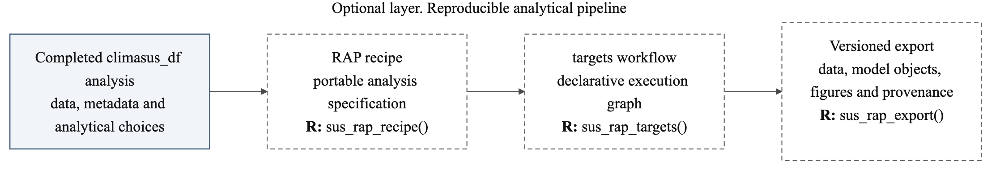
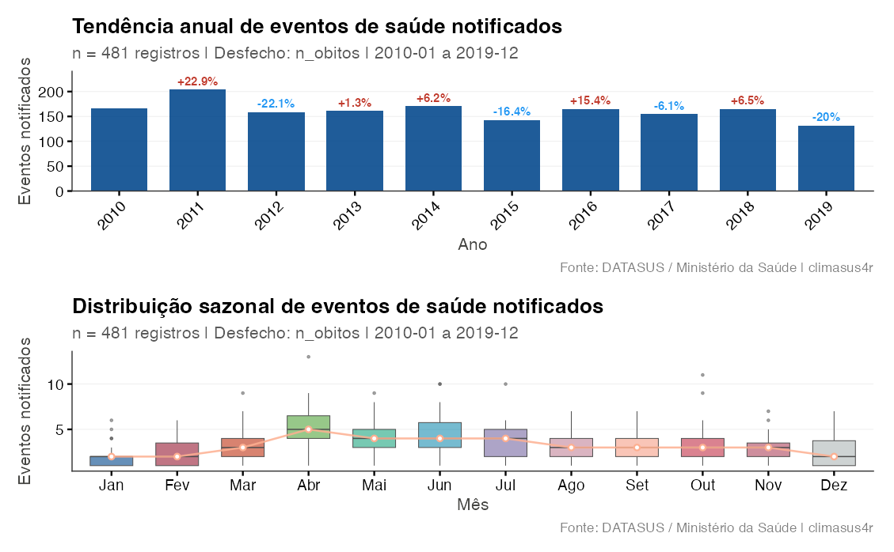
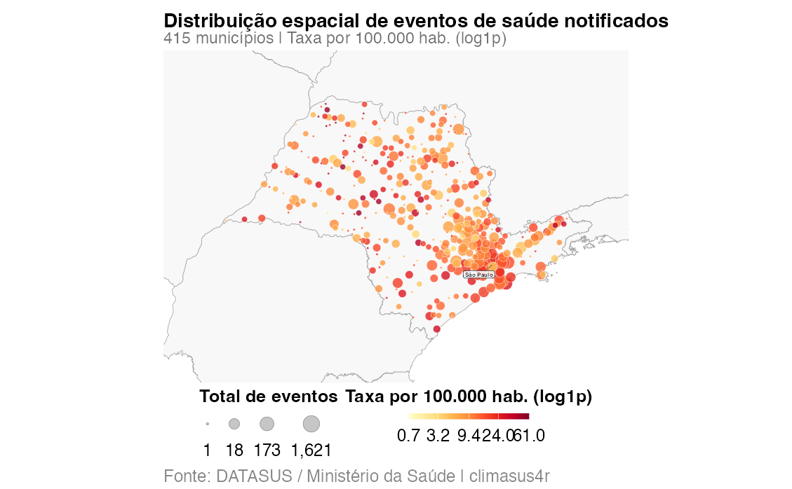

# Summary

`climasus4r` (v.1.0.0) is an R package for reproducible climate-health data integration and epidemiological analysis in Brazil. It enables researchers to combine health records with weather, satellite, and socioeconomic data that are otherwise scattered across incompatible government sources. The package provides workflows for importing, cleaning and linking Brazilian public health data with meteorological observations, gridded climate, air pollution, land-cover information and census data. The resulting datasets support a range of epidemiological designs and analytical strategies, including case-crossover and interrupted time-series designs, as well as distributed lag non-linear models (DLNMs), attributable-fraction and burden estimation, multi-city meta-analysis, and spatiotemporal risk modelling. Its 80+ functions operate on data structures enriched with a `climasus_df` S3 metadata object, with messages and outputs in Portuguese, Spanish and English for multilingual teams and public health practitioners in Brazil and Latin America.

# Statement of Need

The need for tools that facilitate climate-health research is increasing as climate change affects the burden of climate-sensitive diseases worldwide [@romanello2021], including dengue risk from hydrometeorological hazards and urbanisation in Brazil [@lowe2021], heat-related mortality [@zhao2021], and projected temperature-related mortality under future climate scenarios [@gasparrini2017].

Brazil provides access to a rich set of public national and international datasets for climate-health research, including health records from the Brazilian Department of Health Informatics of the Unified Health System (DATASUS), weather-station data from the National Institute of Meteorology (INMET), census indicators from the Brazilian Institute of Geography and Statistics (IBGE), and gridded products such as ERA5-Land, MERRA-2, CAMS and CHIRPS. In practice, however, these datasets are difficult to integrate because they differ in file formats, spatial and temporal resolution, terminology, and data-access conventions. For example, DATASUS distributes microdata in a proprietary compressed format (.dbc), INMET provides point-based observations at hourly, daily and monthly resolutions, and ERA5-Land provides gridded daily fields at an approximately spatial resolution of 9 km. Combining such sources requires reproducible decisions regarding spatial resolution, temporal aggregation, and exposure construction. Furthermore, research teams often repeat the same extraction, cleaning, harmonisation, and linkage steps in project-specific scripts, making analyses more difficult to reproduce and compare across studies.

The data-integration problem is particularly acute in environmental epidemiology, where records must be harmonised across systems, health outcomes linked to municipalities and socioeconomic indicators, and climate exposures aligned with health events under explicit lag assumptions. `climasus4r` addresses this gap through a unified R workflow that takes users from raw multi-source records to model-ready climate-health datasets. It targets Brazilian data infrastructure, but its overall structure is relevant to other settings in which health, climate and socioeconomic data are public but technically fragmented.

# State of the field

Several R packages address parts of the climate-health workflow. `microdatasus` automates the download and preprocessing of DATASUS microdata but does not provide climate integration or epidemiological modelling [@saldanha2019]. `datasus` focuses on pre-aggregated TABNET data [@pradosiqueira_datasus]. `geobr` and `censobr` offer Brazilian geographic and census data, but do not link these data to climate-health exposures [@pereira2022geobr; @pereira2023censobr]. On the modelling side, `dlnm` and `mvmeta` offer tools for distributed-lag modelling and pooling, but assume that exposure and outcome data have already been prepared and linked [@gasparrini2011; @gasparrini2012]. Recent global pipelines, such as the Python framework of Dasgupta et al. (2025), support broad multi-country data integration, but do not perform a workflow tailored to Brazilian health system data or DATASUS-based distributed-lag analyses [@dasgupta2025].

`climasus4r` links these layers within a single workflow: importing DATASUS records, standardising categorical variables, filtering by ICD-10 diagnosis and demographic profile, joining geographic and socioeconomic indicators, constructing aligned climate exposures; and passing the result to modelling functions. Each step is recorded in `climasus_df` metadata to support inspection, auditing and reproduction. Native Parquet/DuckDB support handles larger datasets, and Portuguese, Spanish and English output improves accessibility for multilingual teams.

# Software design

## Architecture and Key functions

\autoref{fig:pipeline} summarises the architecture of `climasus4r`. Its 80+ `sus_*` functions are organized into three layers: data preparation, exposure and covariate integration, and epidemiological analysis and modelling. These layers are supported by diagnostic and visualisation routines and by an optional reproducible analytical pipeline for fully automated workflows.

The data preparation layer ingests records from DATASUS systems, Mortality (SIM), Hospital (SIH/SUS), Outpatient (SIA/SUS), Notifiable Diseases (SINAN), Health Establishments (CNES) and Live Births (SINASC) (\autoref{fig:prep}), importing (`sus_data_import()`), harmonising encodings/codes, defining case groups by ICD-10 and demographic filters, deriving variables, and aggregating into health time series (`sus_data*`).

The exposure and covariate integration layer links outcomes to geographic units and census indicators (`sus_spatial_join()`, `sus_census_join()`), gap-fills INMET station observations, integrates gridded products such as ERA5, CHIRPS, air pollution, drought and fire data (`sus_grid*`), and builds aligned exposure records for modelling (\autoref{fig:exposure}).

The epidemiological analysis and modelling layer supports non-linear models (`sus_mod_dlnm()`), case-crossover and interrupted time-series designs, attributable-fraction and burden estimation, multi-city pooling, and spatial risk analysis (`sus_mod*`), with companion plotting functions for model diagnostics (\autoref{fig:modelling}).

Across all layers, `climasus4r` records data provenance in a `climasus_df` metadata object, accessed with `sus_meta()`, tracking sources, stages and transformation history in outputs compatible with standard R workflows (\autoref{fig:meta}). Recorded choices can be exported via `sus_rap_recipe()`, `sus_rap_targets()` and `sus_rap_export()` as a reproducible analytical pipeline, including `targets` support.

## Temporal exposure-alignment strategies

The main exposure-construction function, `sus_climate_aggregate()`, converts raw climate series into lagged, windowed or threshold-based exposure variables required by statistical models used in epidemiological analyses. It exposes ten named strategies, each corresponding to a specific exposure-lag assumption (\autoref{fig:strategies}). The selected strategy is stored in `climasus_df` metadata, allowing exposure construction to be audited alongside the model that uses it.

Each strategy is anchored to a published design rather than a generic smoothing choice: `exact`/`distributed_lag` follow same-day and distributed-lag mortality designs used in Brazilian cities [@bell2008; @son2016; @gasparrini2010]; `moving_window`/`offset_window` match incubation-period assumptions in dengue climate-suitability models [@lee2021]; `degree_days` operationalises thermal-development thresholds for *Aedes aegypti* [@grech2015]; `seasonal` supports ecological associations such as leishmaniasis and biome-level climate variation [@kersul2025]; `threshold_exceedance`/`cold_wave_exceedance` implement heat-wave and cold-spell definitions for cause-specific mortality in São Paulo [@geirinhas2021; @moraes2022]; and `weighted_window` follows the harvesting-resistant weighted distributed-lag approach from air-pollution research [@bhaskaran2013; @zeger1999]. Default thresholds reflect Brazilian tropical, subtropical and temperate regions and can be overridden by the user.

# Research impact statement

`climasus4r` was developed for and is in active use within the INCT-CONEXAO BIO3TOX project (CNPq Process 408474/2024-6), where it underpins the climate-health data-integration pipeline linking DATASUS records to meteorological and environmental exposures, and its continued development is supported by the PRÓ-AMAZÔNIA project (CNPq Process 442500/2025-4). Near-term community-readiness signals include a companion Python interface, `climasus4py`, and a no-code desktop pipeline, `climasus+ Studio`, both under active development to extend the same reproducible workflow to non-R users, and multilingual (Portuguese/Spanish/English) tutorials aimed at public health practitioners across Brazil and Latin America who are the intended adopters of the package.

The following section illustrates a complete `climasus4r` workflow as a reproducible, runnable example, from importing mortality records to fitting a distributed lag non-linear model, using respiratory deaths among children under five years in São Paulo state (2010-2019). It demonstrates the interoperability of objects across functions through the pipe operator and is a software walkthrough, not an epidemiological analysis. The example is restricted to one municipality and a narrow age stratum, and the ten-year period is chosen only to give the DLNM enough data to fit without error near the tails of the temperature distribution [@gasparrini2015]. Users should adapt the study period, scale, strata and model specification to their own research question; the figures below (\autoref{fig:trend}, \autoref{fig:map} and \autoref{fig:dlnm}) illustrate what the package produces and should not be read as findings about the temperature-mortality relationship.

![Example cumulative exposure-response output (DLNM) relating daily mean temperature to respiratory mortality in children under five, São Paulo city, 2010-2019, using a 21-day lag window (`sus_mod_dlnm()`). Band is the 95% CI and the histogram is the temperature distribution. The plot confirms that the `climasus_df` object from `sus_climate_aggregate(temporal_strategy = "distributed_lag")` passes directly to `sus_mod_dlnm()`/`sus_mod_plot_dlnm()`; given the narrow scope of the example, the shape of the curve illustrates software output only and should not be interpreted as evidence about the temperature-mortality relationship in São Paulo.\label{fig:dlnm}](figures/dlnm_exposure_response.png)

# Tutorial and Ecosystem

Tutorials in Portuguese, English and Spanish are available at https://bymaxanjos.github.io/climasus4r/. They cover climate indicators, heat and cold events, applied climate-epidemiology examples, and reproducible analytical pipelines. `climasus4r` is part of an ecosystem that includes `climasus4py`, a Python interface for Python-based workflows (https://github.com/climasus), and climasus+ Studio, a no-code pipeline interface desktop (https://github.com/ByMaxAnjos/climasus-plus).

# Acknowledgements

We thank the INCT-CONEXAO BIO3TOX project (CNPq Process 408474/2024-6) for supporting the development of this package. We also acknowledge the maintainers and contributors of all R packages, whose work provides an important base for `climasus4r`. João Gobo thanks CNPq for the Research Productivity Fellowship (Process 302900/2026-8) and the PRÓ-AMAZÔNIA project (Process 442500/2025-4) for research funding.

# AI usage disclosure

The authors used Claude Code (Anthropic), a large language model-based coding assistant, to support review and optimisation of selected R scripts, with attention to coding style, reproducibility and maintainability. All AI-assisted outputs were reviewed, edited and verified by the authors for technical accuracy and consistency with the aims of the manuscript and software. The authors take full responsibility for the final content, analyses and code reported in this publication.

# Conflict of Interest

The authors declare no conflicts of interest.

# References
